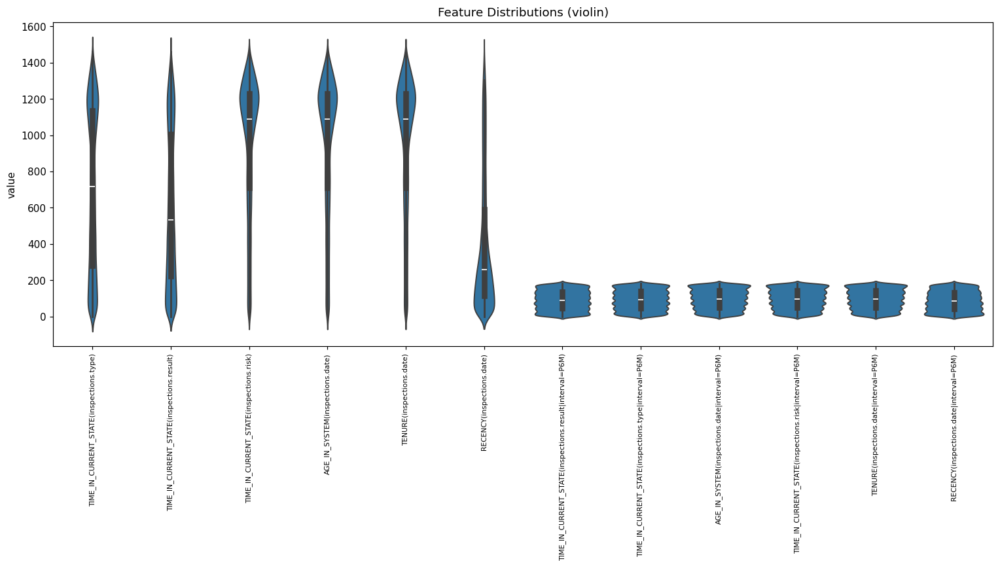
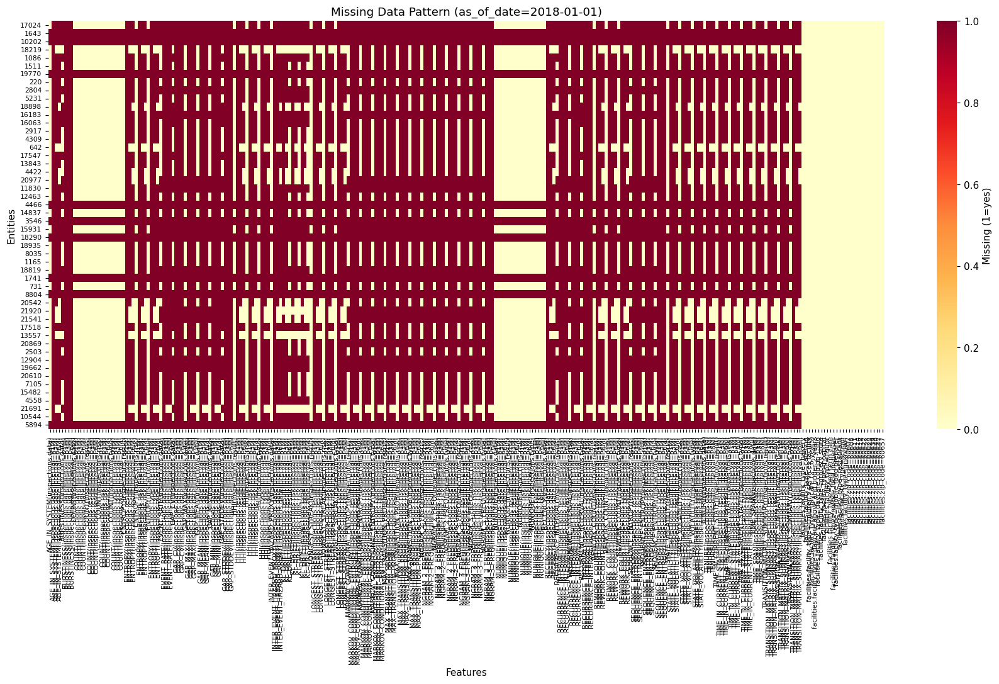
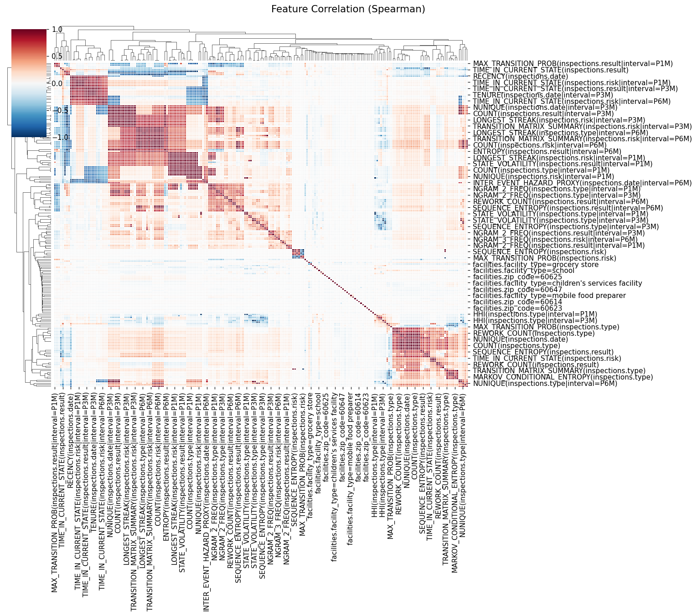
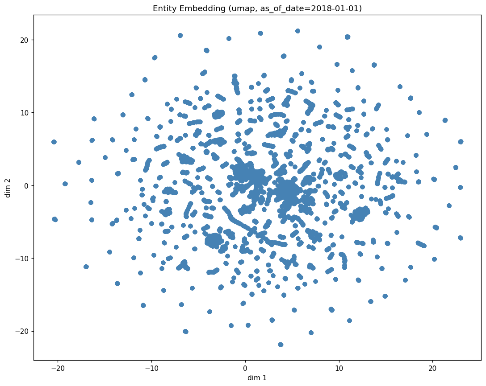
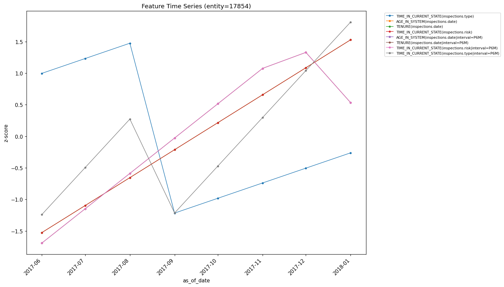
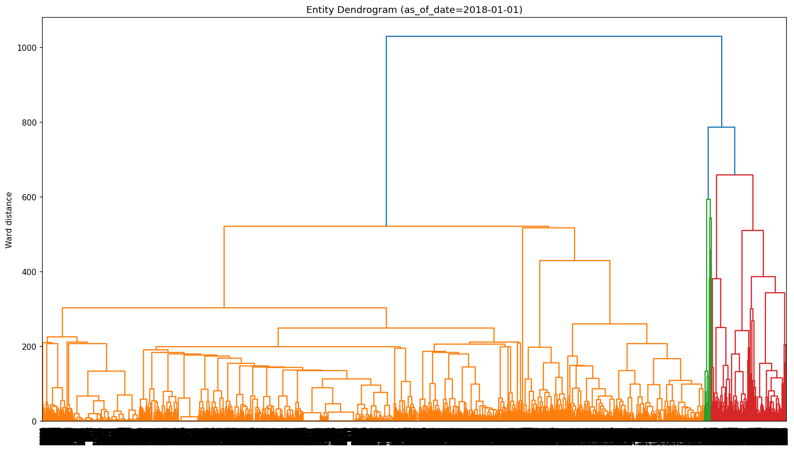

# Featurizer

**Automated feature engineering for temporal data using PostgreSQL.**

**Documentation** — [ccd-ia.github.io/featurizer](https://ccd-ia.github.io/featurizer/):
[Walkthrough](https://ccd-ia.github.io/featurizer/walkthrough/) ·
[Tutorial notebooks](https://ccd-ia.github.io/featurizer/notebooks/) ·
[Primitives](https://ccd-ia.github.io/featurizer/reference/primitives/) ·
[Configuration](https://ccd-ia.github.io/featurizer/reference/configuration/) ·
[ADRs](https://ccd-ia.github.io/featurizer/engineering/adr/) ·
[Validation reports](https://ccd-ia.github.io/featurizer/specs/live-db-revalidation-v080.html)

Featurizer implements [Deep Feature Synthesis](https://groups.csail.mit.edu/EVO-DesignOpt/groupWebSite/uploads/Site/DSAA_DSM_2015.pdf) (DFS; Kanter & Veeramachaneni, IEEE DSAA 2015) for relational
databases with first-class support for temporal semantics. Given a
schema of entities and relationships, it automatically synthesizes
hundreds of meaningful features by traversing the entity graph,
applying aggregations across relationships, and generating
time-windowed statistics.

## Why Featurizer?

Feature engineering is often the most time-consuming part of building
machine learning models on relational data. Featurizer automates this
process by:

-   **Traversing relationships automatically**: Define your entity graph
    once; Featurizer handles the joins and aggregations.
-   **Respecting temporal semantics**: Point-in-time correct features via
    as-of joins prevent data leakage in time-series ML.
-   **Generating pure SQL**: No data movement required&#x2014;features are
    computed where your data lives.
-   **Providing extensible primitives**: 67 aggregations and 83
    transformations out of the box, with a simple API for custom ones.

## Quick Example

    from featurizer import Featurizer
    
    # Load configuration defining entities and relationships
    f = Featurizer("config.yaml")
    
    # Get the generated SQL query
    print(f.query)
    
    # Or execute directly and get a DataFrame
    df = f.to_dataframe()

A simple configuration with customers and orders generates features like:

-   `SUM(orders.amount)` &#x2013; Total order value per customer
-   `COUNT(orders.status|interval=P7D)` &#x2013; Orders in the last 7 days
-   `ROLLING_MEAN_7(orders.amount)` &#x2013; 7-day moving average of order amounts
-   `HOLT_WINTERS_TREND_14(orders.amount)` &#x2013; Trend direction over 14 periods

## Output: DataFrame, Arrow, Parquet

`to_dataframe()` is the notebook/EDA path: it runs the query, returns a pandas
`DataFrame` indexed by `(as_of_date, <target id>)`, and is the right tool for
interactive exploration.

For handing a feature matrix to a training pipeline, use the Arrow/Parquet path.
It is an optional extra&#x2014;install with `uv sync --extra parquet` (pyarrow):

    f = Featurizer("config.yaml")
    table = f.to_arrow()                 # pyarrow.Table
    f.to_parquet("features.parquet")     # writes Parquet directly

These stream the result out of PostgreSQL with binary `COPY` and decode it
column-by-column into Arrow, so the full matrix never round-trips through pandas
and two properties hold that `to_dataframe` does not give cheaply:

-   **NULL fidelity.** A SQL `NULL` (no qualifying events in the window) stays an
    Arrow null, never an `NaN`. pandas coerces integer/boolean columns with nulls
    to `float`+`NaN`, conflating "no data" with "not-a-number".
-   **Keys as columns.** Unlike the DataFrame index, `as_of_date` and the target
    id are ordinary leading columns of the table.

Computed `numeric` aggregates (`AVG`, `STDDEV`, &#x2026;) are cast to `float64`
by default (`numeric_as_float=True`) for an ML-ready matrix; pass
`numeric_as_float=False` to keep exact `decimal128`. Both Arrow paths accept the
same `impute=` contract as `to_dataframe` (see below).

The connection is taken from `DATABASE_URL` / `PG*` (no localhost fallback).
When the query references session `TEMP` tables, pass an open psycopg connection
via `to_arrow(connection=conn)` so the references resolve.

## Wide & oversized matrices

PostgreSQL caps a result/CTE target list at **1664 entries**, so a wide config
(variables x aggregations x intervals x transformers) can exceed it. Featurizer
handles this transparently; `to_dataframe` / `to_arrow` / `to_parquet` /
`to_tables` all "just work" and `.query` raises a clear error (never silent
truncation) when a single query is impossible.

-   **Wide target -> column groups.** When the target's feature tuple is too wide,
    the matrix is partitioned into ordered column groups, each a self-contained
    query leading with `(as_of_date, <target id>)` so they re-join into the full
    matrix. Groups are packed by *dependency lineage* (same-source columns share
    a group, keeping each group's CTE closure — and PostgreSQL's planning cost —
    small) and bounded by a window-function budget. `Featurizer.query_groups`
    returns `OrderedDict[str, str]`; `to_arrow` returns one `pyarrow.Table` when
    it fits else an `OrderedDict` of group tables; `to_parquet(dir)` writes one
    file per group. See
    [ADR-0005](docs/adr/0005-column-group-sharding.md).

-   **Oversized child entity -> temp-table materialization.** When a *non-target
    child* CTE alone exceeds the limit (its consumer `synth`/`transform` cascade
    over it too), that chain is materialized bottom-up into `(as_of_date x entity)`
    keyed `TEMP`-table feature tables via a `CREATE TEMP TABLE … ON COMMIT DROP`
    preamble run on one connection before the group queries. This is automatic on
    every output path; the rejoined matrix is value-identical to the single query.
    `Featurizer.materialization_ddl` exposes the preamble for SQL-only callers, and
    `Featurizer(..., materialize_threshold=N)` lowers the 1664 trigger. See
    [ADR-0006](docs/adr/0006-temp-table-materialization.md).

To **persist** the matrix as triage-style feature-group tables, use `to_tables`:

    f = Featurizer("config.yaml")
    manifest = f.to_tables("features")
    # -> [FeatureGroupTable(name='"features"."customers_group_000"',
    #        group='group_000', key_columns=['as_of_date', 'customer_id']), ...]

It writes each column group as a persistent
`"<schema>"."<stem>_group_<NNN>"` table keyed on `(as_of_date, <target id>)`,
idempotently (drop-if-exists + create), and returns the manifest. The intermediate
materialization shards stay ephemeral; only the final groups persist. Pass
`connection=` to write on an existing session, `table_prefix=` to override the
table stem.

## Imputation contract

Featurizer never imputes inside the generated SQL&#x2014;missingness is signal.
The opt-in pass (`impute=True` on `to_dataframe` / `to_arrow` / `to_parquet`, or
`impute_features` / `impute_arrow` directly) fills **count-like** features
(`COUNT`/`SUM`/`NUNIQUE`/`N_`/`EVENT_RATE`) with the structural zero, leaves
**measures** (`AVG`/`MEDIAN`/`STDDEV`/percentiles/recency/&#x2026;) NULL, and
emits a **stable `<feature>__missing` 0/1 column** for every feature that had
nulls, recorded *before* any fill. Adapters may rely on the
`f"{feature}__missing"` name on both the pandas and Arrow paths
(`featurizer.MISSING_INDICATOR_SUFFIX`).

`measure_strategy="mean"` / `"median"` fits the fill over the **whole returned
matrix** (every as-of date and the entire cohort, including validation/test
rows)&#x2014;temporal leakage (ADR-0001). On the engine paths it is refused
unless you also pass `allow_full_matrix_fit=True`, and even then it emits a
runtime warning. Fit imputers on your training split instead.

## Direct categorical variables (roles & one-hot)

A direct variable on the **target** entity can declare a `role` that controls how
it reaches the matrix, independent of its storage `type`:

    entities:
      - alias: facilities
        id: license_no
        table: dirtyduck.facilities
        temporal_ix: first_seen
        variables:
          name:          { type: text, role: identifier }
          facility_type: { type: categorical, role: categorical }   # vocabulary from the ENUM
          risk_band:     { type: categorical, role: categorical,
                           vocabulary: [low, medium, high] }         # declared vocabulary
          risk_score:    { type: numeric }

-   **`identifier`** — excluded from the output (a name, license number, exact
    address), with a loud log line. Featurizer is exhaustive, so the omission is
    explicit, never silent.
-   **`categorical`** — one-hot encoded into deterministic 0/1 columns (below).
-   **`numeric`** (and the no-role default) — passthrough. A raw `text` /
    `categorical` variable left with no role still passes through, but warns first:
    a raw string column is the usual cause of a crash in a downstream encoder.

**Fixed, fit-free vocabulary.** Encoding a categorical needs a vocabulary, and
where it comes from is a leakage boundary. Featurizer is split-blind, so it will
**only** use a vocabulary that is *declared* — a `vocabulary: [...]` list, or the
column's PostgreSQL `ENUM` labels — and **never** learns one by scanning the data
(that fitted, train-only transform belongs to the consumer). A `role: categorical`
variable with neither a declared vocabulary nor an introspectable `ENUM` **fails
loud**.

A declared vocabulary keeps `.query` / `--show-sql` fully DB-free. Reading `ENUM`
labels needs a connection: pass one as `Featurizer("config.yaml", connection=conn)`,
else one is opened from `DATABASE_URL` / `PG*`.

**One-hot columns.** Each value becomes a numeric column named
`"<entity>.<column>=<value>"` — e.g. `"facilities.facility_type=Restaurant"` — a
quoted PostgreSQL identifier capped at 63 bytes (the standard hash-truncation). The
expression is `case when <col>::text = '<value>' then 1 else 0 end`, so a **NULL or
out-of-vocabulary** value is an all-zero row, never a crash. The vocabulary is
sorted for a stable column order across runs. These are ordinary numeric feature
columns on every output path (`to_arrow(impute=True)` included); a consumer strips
the key columns + `*__missing` and treats the rest as features.

Child-event categoricals are unchanged — they are reduced to numeric via
aggregation, not one-hot. See
[ADR-0007](docs/adr/0007-direct-categorical-fixed-vocabulary.md).

## Feature manifest

A generated feature name longer than PostgreSQL's 63-byte identifier limit is
hash-truncated, which erases the readable tail. `Featurizer.feature_manifest`
(and `.manifest_dataframe()`) map every output `column` back to its full,
untruncated `label`, so humans, plots, and partner-facing tables can recover the
intended name:

    f = Featurizer("config.yaml")
    for e in f.feature_manifest:
        print(e.column, "<-", e.label, e.kind)
    # facilities.facility_type=Restaurant <- facilities.facility_type=Restaurant  one_hot

Each entry carries `column`, the full `label`, a `truncated` flag, `kind`
(`one_hot` | `variable` | `derived`), the owning `entity`, and — for one-hot
columns — the `source_column` and `value` they encode. Since v0.5.0 entries
also carry **lineage** — `depth` (derivation depth), `parents` (immediate
parent labels), `source_alias` (the relationship/entity stream a derived
feature was computed over), the outermost `interval` window — and a generated
human `description` ("Sum of all values, applied to orders.amount, over the
trailing P1M window"). `manifest_dataframe()` returns the same as a pandas
`DataFrame` you can join onto the matrix for readable plot legends.

`to_tables(schema)` additionally persists the manifest as
`"<schema>"."<stem>_manifest"` next to the feature-group tables — one row per
output column, including the `feature_group` table it landed in, joinable back
to the group tables by column name (the metadata-beside-the-features idiom
triage-style consumers expect).

## Selecting primitives

By default Featurizer applies a curated active set (`count`, `mean`, `sum`,
`stddev`, `min`, `max`, `median`, `nunique`, `recency`, `tenure`, plus the
default transformers). Override per-config with optional `aggregations:` and
`transformations:` lists &#x2014; any registered primitive name is valid (run
`python -m featurizer list-primitives` to see them all); an unknown name raises
a validation error with a "did you mean?" suggestion.

    target: customers
    max_depth: 2
    intervals: [P7D, P1M]
    aggregations: [sum, mean, recency, gap_cv, entropy]
    transformations: [identity, lag_1, rolling_mean_7]
    entities:
      # ...

## Examples

The `examples/` directory contains six self-contained tutorials that run
against PostgreSQL (`just db-up` starts a throwaway container):

<table border="2" cellspacing="0" cellpadding="6" rules="groups" frame="hsides">

<colgroup>
<col  class="org-left" />

<col  class="org-left" />

<col  class="org-left" />
</colgroup>
<thead>
<tr>
<th scope="col" class="org-left">Example</th>
<th scope="col" class="org-left">Scenario</th>
<th scope="col" class="org-left">Concepts</th>
</tr>
</thead>
<tbody>
<tr>
<td class="org-left"><a href="examples/01-basic-aggregations/">01-basic-aggregations</a></td>
<td class="org-left">E-commerce (Customers → Orders)</td>
<td class="org-left">Parent-child relationships, time windows</td>
</tr>

<tr>
<td class="org-left"><a href="examples/02-temporal-joins/">02-temporal-joins</a></td>
<td class="org-left">Healthcare (Patients → Care Plans)</td>
<td class="org-left">As-of joins, grace periods</td>
</tr>

<tr>
<td class="org-left"><a href="examples/03-deep-nesting/">03-deep-nesting</a></td>
<td class="org-left">Retail (Stores → Orders → Products → Suppliers)</td>
<td class="org-left">Multi-level traversal (depth=3)</td>
</tr>

<tr>
<td class="org-left"><a href="examples/04-custom-primitives/">04-custom-primitives</a></td>
<td class="org-left">Finance (Accounts → Transactions)</td>
<td class="org-left">Custom aggregations and transformations</td>
</tr>

<tr>
<td class="org-left"><a href="examples/05-categoricals-output/">05-categoricals-output</a></td>
<td class="org-left">Food Inspections (Facilities → Inspections)</td>
<td class="org-left">Categorical one-hot, manifest, output &amp; imputation (executes on PostgreSQL)</td>
</tr>

<tr>
<td class="org-left"><a href="examples/06-graph-text-bridge/">06-graph-text-bridge</a></td>
<td class="org-left">Coordination detection (Authors → Posts)</td>
<td class="org-left">φ-bridges: sentiment, near-duplicate edges, centrality snapshots → spine (executes on PostgreSQL)</td>
</tr>
</tbody>
</table>

To run an example:

    cd examples/01-basic-aggregations/
    
    # Generate sample data
    python create_data.py
    
    # Run feature generation (shows summary)
    python run_example.py
    
    # View generated SQL
    python run_example.py --show-sql
    
    # Execute and save results
    python run_example.py --execute --output features.csv

Each example includes a Jupyter notebook (`tutorial.ipynb`) for
interactive exploration.

## Supported Feature Primitives

-   **Aggregations:** count, mean, sum, stddev, median, mode, nunique,
    min/max, variance, harmonic/geometric means, deviation metrics, and
    more; interval windows are supported when entities declare temporal
    indexes.
-   **Percentiles:** p10, p25, p75, p90, p95, p99 via ordered-set
    aggregates.
-   **Distribution metrics:** interquartile range (iqr), coefficient of
    variation (cv), range (max minus min).
-   **Inter-event gap statistics:** gapmean, gapstddev, gapmin,
    gapmax, gapcv &#x2014; computed via `SubqueryAggregator` over consecutive
    event timestamps.
-   **Temporal patterns:** burstiness (Goh-Barabasi index, -1 to 1),
    eventrate, timespan.
-   **Categorical distribution:** entropy (Shannon), hhi
    (Herfindahl-Hirschman Index).
-   **Inequality:** gini coefficient (0 = equality, 1 = maximum
    inequality).
-   **Sequence features:** ngram2freq, ngram3freq, sequenceentropy,
    longeststreak &#x2014; analyze sequential patterns in categorical event
    streams.
-   **Scalar transforms:** identity, abs/exp/log/sqrt, ceil/floor/trunc,
    text length, boolean checks (isnull, inarray), binary
    arithmetic/logic operators, and categorical/date part extractors (day,
    dow, month, hour, etc.).
-   **Temporal windows:** cumulative sums/means/min/max/count,
    lag/lead-style `previous`, diff/timesinceprevious, percentile-based
    distribution metrics (CDF, percentrank, ntile).
-   **Rolling statistics:** moving averages and standard deviations (3/7/14
    rows), rolling medians and IQRs, exponential moving averages,
    Holt-Winters-inspired level/trend regressions, percentage change over
    configurable lags.
-   **Cyclical encoding:** sine/cosine projections for hours/months/days
    plus hourly/daily binning helpers.
-   **Population windows:** crossentityzscore, crossentitypercentile
    for normalizing across all entities.
-   **Change-point detection:** meanshiftratio7/14, cusum for
    identifying regime changes.
-   **Temporal joins:** relationship-level `temporal` blocks enable as-of
    lateral joins with optional grace periods, letting target rows pull
    the latest parent record as of each timestamp.
-   **Named relationships (v0.5.0):** parallel relationships between the
    same entity pair (e.g. `customers→orders` via `buyer_id` *and* via
    `seller_id`) must each declare a distinct `name:` — validation errors
    otherwise. The name replaces the child alias in feature and CTE names
    (`SUM(purchases.amount|interval=P1M)`,
    `purchases_aggs_for_customers`) and qualifies columns transferred by
    named forward/as-of relationships (`"purchases.score"`). Unambiguous
    configs need no `name:` and keep byte-identical feature names.
    Parent/child key columns may have different names on each side
    (`parent: customers.customer_id` / `child: orders.buyer_id`) —
    generated SQL references each side's own column. See ADR-0008.

## Planner Passes & φ-Bridge Families (beyond the registry)

Some feature families are not registry primitives — they are **planner
passes** driven by their own config blocks, or **φ-bridge** precomputes
(heavy Python that materializes a column the SQL spine then aggregates):

-   **Peer groups** (`peer_groups` on an entity): leave-one-out comparisons
    against peers sharing a categorical — `PEER_GROUP_SIZE`, `PEER_MEAN`,
    `PEER_ZSCORE`, `PEER_PCTILE`, `EGO_MINUS_PEER_MEAN`, `PEER_EVENT_RATE`.
-   **Spatial relationships** (`spatial_relationships`, top-level):
    co-location count, distance-to-nearest, and KDE intensity between two
    entities with lat/lon indexes.
-   **Graph relationships** (`graph_relationships`, top-level, v0.9.0):
    native 1-hop graph features over an edge table, in pure SQL — as-of
    `DEGREE` (plus windowed variants per interval) and neighbour-state
    `NEIGHBOUR_MEAN` / `NEIGHBOUR_SHARE`, bounded by *both* the edge
    timestamp and the neighbour state's timestamp. Strictly 1-hop by
    design (2-hop leaks neighbours' future labels).
-   **φ-bridge families** (`featurizer/bridge/`, the `[bridge]` extra):
    sentiment / readability / language-id / NER counts, multi-metric
    centralities and Louvain community over per-window snapshot rebuilds,
    sentence embeddings, embedding-trajectory novelty/drift/volatility,
    change-point and periodicity scores, and text-induced edge builders
    (near-duplicate MinHash/LSH, co-mentions) that feed the graph
    features. See ADR-0001/ADR-0014 for the causal contract.

Full documentation:
[configuration reference](https://ccd-ia.github.io/featurizer/reference/configuration/)
(every config block) and the
[bridge cookbook](https://ccd-ia.github.io/featurizer/engineering/bridge-cookbook/)
(worked examples per modality, two-stage text→edges→graph wiring,
dependency matrix).

## Feature Primitive Registries

-   Aggregation primitives register themselves via `register_aggregation`
    in `featurizer/primitives/aggregations.py`. New aggregators should
    call `register_aggregation("my_name", my_callable)` so they are
    discoverable without editing `featurizer/featurizer.py`.

-   Transformation primitives follow the same pattern using
    `register_transformer`. Avoid mutating the incoming `Feature`; always
    return a new instance (or list of instances) for deterministic
    hashing.

-   The runtime loads a default subset (`count`, `mean`, `sum`, `stddev`,
    `identity`, `abs`, `cum_sum`, `day`, `dow`, `month`, `lag_1`, `lag_3`,
    `lag_7`, `rolling_mean_3`, `rolling_std_7`, `rolling_median_7`,
    `rolling_iqr_7`, `ema_7`, `holt_winters_level_7`,
    `holt_winters_trend_7`, `pct_change_1`) and can be extended by
    requesting specific names via `get_aggregations` / `get_transformers`.
    In total there are 67 aggregations and 83 transformers (150
    registered primitives). Use `python -m featurizer list-primitives` to
    discover all registered primitives. Peer-group, spatial second-table,
    and φ-bridge features are produced by dedicated planner passes rather
    than the primitive registry.

-   Example registration:
    
        # featurizer/primitives/aggregations.py
        class SumSquares(Aggregator):
            def __init__(self):
                super().__init__(name="sum_squares")
        
            def _build_aggregate_expression(self, feature, interval):
                base = super()._build_aggregate_expression(feature, interval)
                return base.replace(feature.name, f"{feature.name} * {feature.name}")
        
        sum_squares = SumSquares()
        register_aggregation("sum_squares", sum_squares)
    
    After registration, request it from the planner with:
    
        custom_aggs = get_aggregations(["sum_squares", "mean"])

## Debugging & Logging

-   The planner emits structured debug logs through
    [loguru](https://github.com/Delgan/loguru). Set
    `logger.remove()=/=logger.add(...)` in your entry point to adjust
    verbosity.
-   Set `FEATURIZER_DEBUG=1` (or pass `debug=True` to `Featurizer`) to
    mirror planner milestones via
    [icecream](https://github.com/gruns/icecream). The emitted payloads
    show traversal depth, aggregation counts, and transformation totals.
-   Planner/renderer/executor components live in `featurizer/planner.py`,
    `featurizer/sql.py`, and `featurizer/executor.py` respectively&#x2014;each
    can be imported independently for bespoke workflows.

## Temporal Joins

-   Declare `temporal` blocks on relationships (e.g., `mode: as_of`,
    optional `grace`) to pull the most recent parent record as of each
    target timestamp. The planner materializes these as
    `LEFT JOIN LATERAL` clauses so the nearest match&#x2014;and only that
    match&#x2014;feeds downstream transformations.
-   Source entities can override the timestamp column via
    `child_timestamp`; otherwise their declared `temporal_ix` is used.
    Temporal joins fall back to static key joins when either side lacks a
    temporal index.

## Visualization

After materializing the feature matrix, `FeaturizerViz` turns it into
diagnostic plots. It is an optional extra&#x2014;install with
`uv sync --extra viz` (matplotlib, seaborn, plotly, scikit-learn, scipy,
networkx, umap-learn).

    from featurizer import Featurizer, FeaturizerViz
    
    f = Featurizer("config.yaml")
    viz = FeaturizerViz.from_featurizer(f)          # resolves the entity id column
    
    # Distribution & data quality
    viz.feature_summary_table()                     # mean/std/skewness/% missing
    viz.plot_feature_distributions(kind="violin")
    viz.plot_missing_heatmap()
    
    # Redundancy & importance
    viz.plot_correlation_clustermap()
    viz.plot_feature_importance(target_col="label") # mutual_info | f_classif | f_regression
    viz.plot_feature_variance()
    
    # Entity structure (a single as-of slice)
    viz.plot_entity_embedding(method="umap")        # 'umap' | 'tsne' | 'pca'
    viz.plot_entity_dendrogram()
    
    # Per-entity time series
    viz.plot_feature_timeseries(entity_id=42, normalize=True)
    viz.plot_entity_feature_heatmap(entity_id=42)

`from_featurizer` reads the target entity's id column so the matrix's
`(as_of_date, <id>)` index is interpreted correctly; pass a plain DataFrame
to `FeaturizerViz(df, entity_col`&#x2026;)= if you materialized it elsewhere.
Methods that need a complete matrix (importance, embedding, dendrogram)
median-impute a **local copy**&#x2014;the stored matrix keeps its NULLs as signal.

### Gallery

Real plots from a live 177k-row × 272-feature matrix (the
[dirtyduck](https://github.com/dssg/dirtyduck) food-inspections data, full
default aggregator set, 8 monthly as-of dates):

<table>
<tr>
<td align="center"> <code>plot_feature_distributions(kind="violin")</code></td>
<td align="center"> <code>plot_missing_heatmap()</code></td>
</tr>
<tr>
<td align="center"> <code>plot_correlation_clustermap()</code></td>
<td align="center"> <code>plot_entity_embedding(method="umap")</code></td>
</tr>
<tr>
<td align="center"> <code>plot_feature_timeseries(entity_id=…, normalize=True)</code></td>
<td align="center"> <code>plot_entity_dendrogram()</code></td>
</tr>
</table>

## Testing

Run the test suite with:

    uv run pytest -q
    
    # With coverage report
    uv run pytest --cov=featurizer --cov-report=term-missing

### Tested compatibility matrix

Every release is CI-tested on this matrix — a support claim we test is a
promise; anything outside it may work but is not verified:

| axis | versions |
|---|---|
| Python (DB-free tier) | 3.10 · 3.11 · 3.12 · 3.13 |
| PostgreSQL (integration tier, generated SQL executed) | 14 · 16 · 17 |

## Project Map

-   `featurizer/` &#x2013; Core modules (planner, sql, executor, validation)
-   `featurizer/primitives/` &#x2013; Aggregation and transformation primitives
-   `tests/` &#x2013; Test suite (385 tests)
-   `examples/` &#x2013; Six self-contained examples executing against PostgreSQL
-   `docs/` &#x2013; Session history and primitives reference

