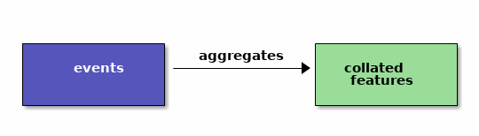
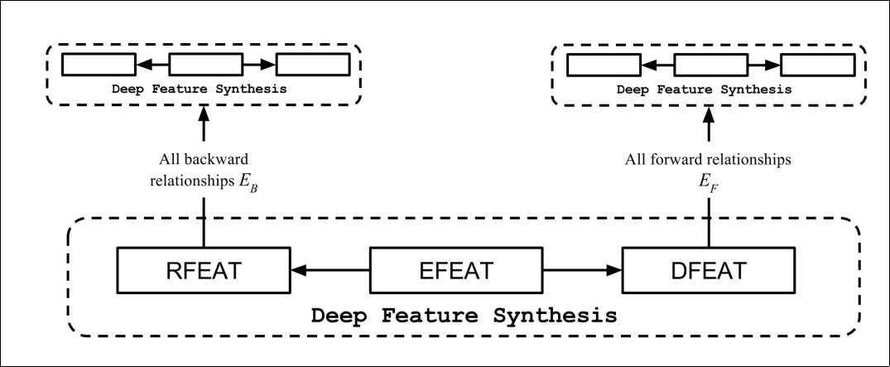
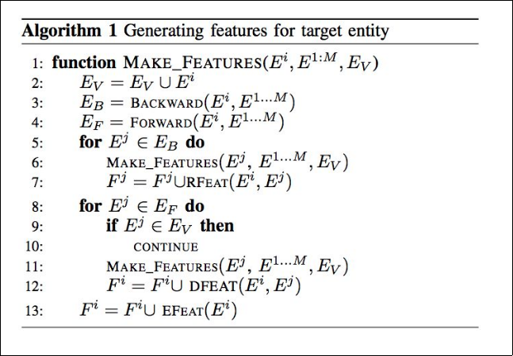
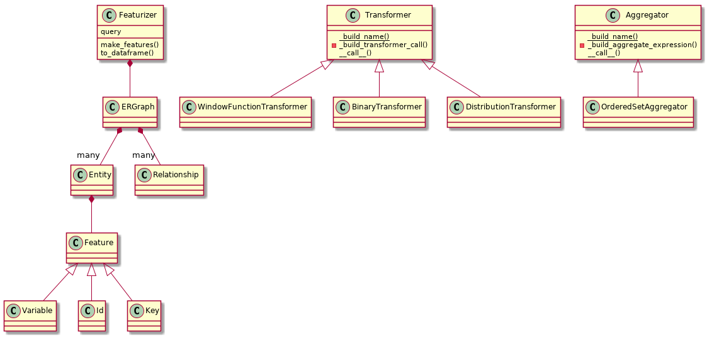

#+TITLE: Featurizer
#+AUTHOR: Adolfo De Unánue
#+EMAIL: adolfo@uchicago.edu
#+startup: beamer
#+LaTeX_CLASS: beamer
#+LaTeX_CLASS_OPTIONS: [presentation, smaller]
#+OPTIONS: H:1 toc:t num:t
#+BEAMER_FRAME_LEVEL: 1
#+PROPERTY: header-args :var pages=12
#+BEAMER_THEME: default
#+BEAMER_HEADER: \subtitle{More features for everyone!}
#+BEAMER_HEADER: \institute[DSaPP]{Center for Data Science and Public Policy\\\url{http://dsapp.uchicago.edu}}

* Collate

** One step aggregation to =as_of_dates=

#+BEGIN_SRC ditaa :file images/collate.png :exports none

+---------------+                +---------------+
|cBLU           |   aggregates   | cGRE          |
|     events    |--------------->|  collated     |
|               |                |   features    |
|               |                |               |
+---------------+                +---------------+

#+END_SRC

#+RESULTS:

** Confusing / Non-intuitive  semantics

*** The /meaning/ (originally) refers to the aggregated variable
    - The =aggregate= is numeric, even if the variable was categorical
    - Then =categorical= is just a filter over the aggregate function
    - Weird use of =max=
    - Incorrect interpretation of =avg=
    - /encoding/ is defined as a /ad-hoc/ implementation of =ohe=

* What do we want to achieve?

** Expand the features available to =triage=

** Improve =collate='s semantics

** Simplify the way to adding new features

** Add governance to the features

*** Feature metadata

*** Short names

*** Descriptions

*** /Some stats/ (Not implemented yet)

* What did we do?

** We implemented the *DFS algorithm* (=2015=) in a mix of =Python / =PostgreSQL= as the feature generator

** We added some =triage= specific functionality

*** time intervals

*** feature groups

* How DFS works? : Generalities

** *DFS* = /Deep feature synthesis/

** Recursive algorithm

*** It traverses the tables through the relationships between tables

*** A slightly modification of a BFS for graph traversal

** Originally built for =MySQL=

*** No temporal handling at the beginning

** Currently, the open version works in =python=

* TODO How DFS works?: /Backward/ and /Forward/ relationships

* TODO How DFS works?: Transformers, Aggregators and Direct Transfers

* How DFS works? Graphically
  :PROPERTIES:
  :ATTACH_DIR: /home/nanounanue/projects/delorean/images
  :END:

#+CAPTION: Image from /Deep Feature Synthesis: Towards Automating Data Science Endeavors/

* How DFS works? Algorithm
  :PROPERTIES:
  :ATTACH_DIR: /home/nanounanue/projects/delorean/images/
  :END:

#+CAPTION: Clip from /Deep Feature Synthesis: Towards Automating Data Science Endeavors/

* Featurizer

** Implements the *DFS algorithm* in =python= to generate =sql=

** Supports a bigger set of /transformations/ and /aggregations/ than the current =DFS=

** Tracks the features dependencies

** Generates =SQL=

*** At this moment as a chain of =CTEs=

*** /Planned/: Allow the user to specify =Temporary tables= / =tables= instead of the =CTEs=

**** In that way you can achieve better performance (/not implemented yet/)

** Executes the SQL

*** This is just for testing, when incorporated to =triage= it will use =architect=

* Featurizer

** The idea is /automatically/ generate features /for/ a specific =target=

** The function's set is applied /globally/

** You can control the functions to be applied through /whitelists/ and /blacklists/

** The intervals are /global/ too

   - The reason behind this is a conceptual one: the config file
     /defines/ the structure of the /input/ tables no the /way to transform them/

** The other knob is =max_depth=

* Class structure

#+BEGIN_SRC plantuml :file images/featurizer_class_diagram.png :exports results

Featurizer *-- ERGraph

ERGraph *-- "many" Entity
ERGraph *-- "many" Relationship

Entity *-- Feature

Feature <|-- Variable
Feature <|-- Id
Feature <|-- Key

Transformer <|-- WindowFunctionTransformer
Transformer <|-- BinaryTransformer
Transformer <|-- DistributionTransformer

Aggregator <|-- OrderedSetAggregator

Featurizer : query
Featurizer : make_features()
Featurizer : to_dataframe()

Aggregator : {static} _build_name()
Aggregator : - _build_aggregate_expression()
Aggregator : __call__()

Transformer : {static}  _build_name()
Transformer : - _build_transformer_call()
Transformer : __call__()

#+END_SRC

#+RESULTS:

* How to use it?

** =YAML= configuration file

** Example =python= code:

#+BEGIN_EXAMPLE ipython
featurizer = Featurizer('test.yaml')

featurizer.query  # shows the query

df = featurizer.to_dataframe() # Or gets you a dataframe
#+END_EXAMPLE

* Example

* What is missing? / Limitations

** The =SQL= generation is quite dumb, there is no /pruning/

** Unit tests

** Solve the column limit in PostgreSQL

** Maybe we could simplify the configuration file /if/ we specify the DB connection and use /metadata/ magic

** Avoid stacks that don't make sense

** Store the Features metadata table
