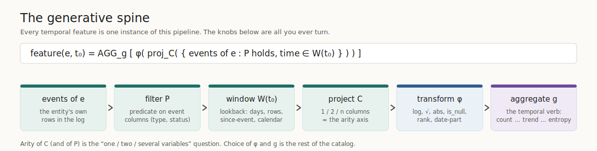
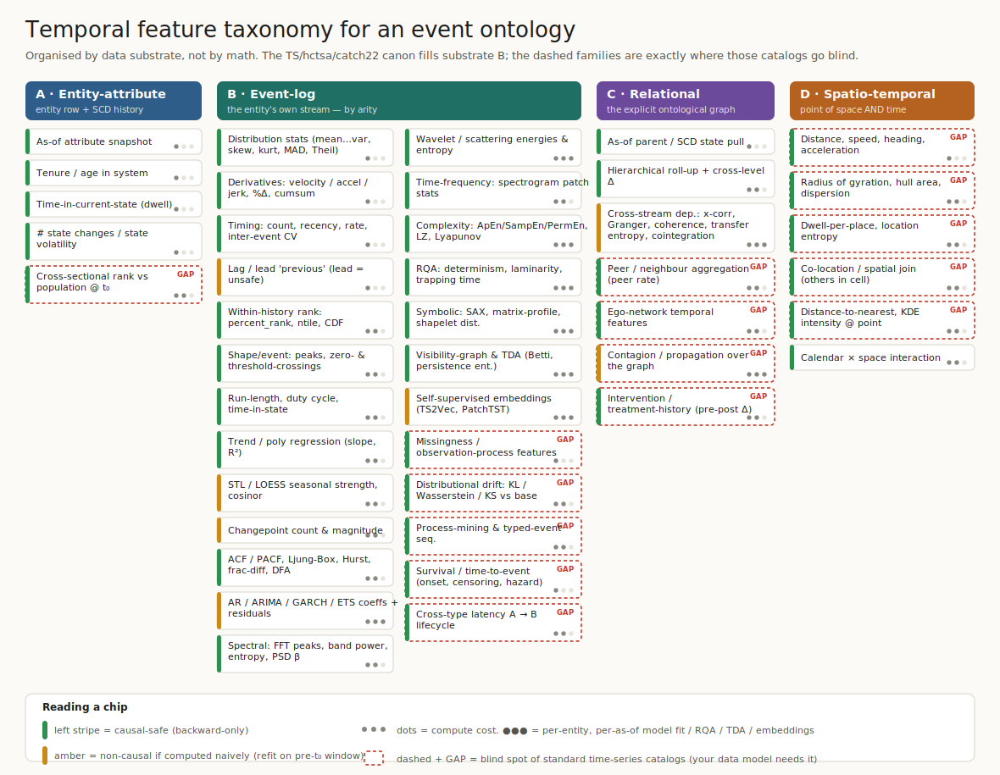

#+TITLE: Temporal Feature Taxonomy for Event-Ontology Data
#+SUBTITLE: A canonical reference, organized by data substrate rather than by mathematics
#+OPTIONS: toc:2 num:t
#+STARTUP: showall inlineimages
#+LATEX_HEADER: \usepackage[margin=2cm]{geometry}

* 0. Orientation

** The data model this is built for
A database that reflects an *ontology*: one or more *entity* tables, plus one or
more *event* tables, where every event row is /a thing that happened to an
entity at a particular point in space and time/. Concretely, the working
schema we assume is:

#+begin_src sql
entity(entity_id, <slowly-changing attributes...>, parent_id, ...)
event (event_id, entity_id, ts, event_type, status, amount, lat, lon, ...)
relation(entity_id, related_id, kind, valid_from, valid_to)
#+end_src

This is *not* a regularly-sampled signal. It is irregular, typed,
multi-entity, relational, and spatial. That distinction governs everything
below.

** Why the standard time-series catalogs under-fit it
The tsfresh / hctsa / catch22 / DSP canon (distribution stats, spectral,
wavelet, nonlinear-dynamics, RQA, …) is deep — but it assumes a clean numeric
signal on a grid. It is therefore rich in exactly the dimension this data is
*thin* (the single channel's waveform) and nearly silent in the dimensions
this data is *thick*: missingness, typed-event sequences, the explicit
relational graph, and space. Those silences are the four "GAP" bands in the
figure below — they are not exotic, they are where the predictive signal in
event ontologies usually lives.

** How to read the tags
Every family carries two tags.

- *Causal-safety* — does the estimator look only backward from t₀?
  - =[safe]=  backward-only by construction.
  - =[care]=  non-causal /if computed naively/ (two-sided smoothers, full-series
    model fits, =lead=, embeddings trained on the whole trajectory). Legal only
    if refit strictly on the pre-t₀ window. This is the dominant leakage trap.
- *Cost* — compute per (entity, as-of-date):
  - =●○○= cheap, expressible as SQL window functions, O(events).
  - =●●○= medium (spectral, wavelet, ACF, entropy, regression, distances).
  - =●●●= expensive: per-entity-per-as-of model fits, RQA, TDA, Lyapunov,
    learned embeddings. At feature-store scale these can dominate the whole
    pipeline; budget them deliberately.

* 1. The generative spine

Every temporal feature is one instance of a single schema. The knobs are all
you ever turn.

#+begin_export latex
\[
\mathrm{feature}(e, t_0) \;=\; \mathrm{AGG}_g\!\Big[\; \varphi\big(\,\mathrm{proj}_C(\{\, \text{events of } e : P \text{ holds},\ \text{time} \in W(t_0) \,\})\,\big) \;\Big]
\]
#+end_export

#+begin_quote
feature(e, t₀) = AGG_g[ φ( proj_C( { events of e : P holds, time ∈ W(t₀) } ) ) ]
#+end_quote

- *e* — entity (unit of analysis).
- *t₀* — as-of / knowledge date (the prediction time).
- *W(t₀)* — lookback window: days, *rows* (last N events — essential for
  irregular streams), since-event, calendar-aligned, or nested (recent vs base).
- *P* — filter predicate on event columns (type, status, …).
- *C* — projected column(s). *Arity of C is the "one / two / several variables"
  axis.* The transform layer φ sits between projection and aggregation; I had
  originally collapsed it, which is why scalar transforms (log, √, =is_null=,
  rank, date-part) were missing from the first pass.
- *g* — the temporal verb. The whole catalog is a choice of φ and g.

#+CAPTION: The generative spine. Turning these six knobs reproduces every family below.

* 2. The four substrates

Organize by /where the feature reads from/, not by which branch of mathematics
produces it. Four substrates:

- *A — Entity-attribute (as-of state):* the entity row and its slowly-changing
  history.
- *B — Event-log:* the entity's own stream of events. This is where the entire
  TS canon lives, split by arity.
- *C — Relational:* the explicit ontological graph — parents, peers, hierarchy.
- *D — Spatio-temporal:* because every event also carries a /place/.

#+CAPTION: Feature families by substrate. Left stripe = causal-safety; dots = cost; dashed + GAP = blind spot of standard TS catalogs.

* 3. The catalog

** A. Entity-attribute (as-of state)
- =[safe ●○○]= *As-of attribute snapshot* — the entity's attribute value as it
  stood at t₀ (slowly-changing-dimension lookup).
- =[safe ●○○]= *Tenure / age in system* — time since first-seen.
- =[safe ●○○]= *Time-in-current-state (dwell)* — how long in the present
  attribute value.
- =[safe ●○○]= *State volatility* — number of attribute changes in window.
- =[safe ●●○]= *Cross-sectional rank vs population @ t₀* — z-score / percentile
  of the entity against the /population/ at t₀ (peer-relative, distinct from
  within-history rank). *[GAP]*

** B. Event-log — the entity's own stream
*** B.1 One variable (time + one column)
- =[safe ●○○]= *Distribution stats* — mean, median, trimmed mean, mode, var,
  std, MAD, IQR, min/max, range, quantiles, *skewness, kurtosis*, Gini, *Theil*,
  *geometric & harmonic means* (harmonic = correct average speed/rate).
- =[safe ●○○]= *Derivatives* — first/second/third differences (velocity,
  acceleration, jerk), mean/abs/ratio/percent change, cumsum/cumprod; rolling
  and EWMA versions of all of these.
- =[safe ●○○]= *Timing (time-only)* — count, cumulative count, recency
  (time-since-last), rate, inter-event gap mean/std/*CV*/burstiness, max gap.
- =[care ●○○]= *Lag / lead =previous== — lag-k is safe; *lead is leakage* unless
  the row is genuinely forward-dated (scheduled).
- =[safe ●●○]= *Within-history rank* — =percent_rank=, =ntile=, CDF position of
  the /current/ value inside the entity's own past. Self-normalization.

*** B.2 Shape, trend, memory (mostly one variable)
- =[safe ●●○]= *Shape / event descriptors* — peak/trough count, height, width,
  prominence, area; zero-crossing rate; threshold-crossing counts; run-length /
  longest streak; on/off duty cycle.
- =[safe ●●○]= *Trend* — linear/polynomial regression coefficients (slope,
  intercept, R²); momentum (recent-window ÷ baseline-window).
- =[care ●●○]= *Seasonality* — STL / LOESS seasonal strength; *cosinor* (mesor,
  amplitude, acrophase); changepoint count & magnitude. (Two-sided → refit
  pre-t₀.)
- =[safe ●●○]= *Autocorrelation & memory* — ACF / PACF at lags, Ljung–Box;
  *Hurst exponent*, fractional-differencing d̂, *DFA* scaling exponent;
  variance-ratio, KPSS / ADF stationarity statistics.
- =[care ●●●]= *Model coefficients & residuals* — AR / ARIMA / GARCH / ETS /
  Prophet / state-space parameters; one-step forecast errors (MAE, MAPE, RMSSE,
  pinball); residual ACF, ARCH-LM; *ensemble model disagreement*. (All fits must
  be on the pre-t₀ window.)

*** B.3 Frequency, complexity, recurrence (one variable, expensive)
- =[safe ●●○]= *Spectral (FFT / PSD)* — dominant frequencies, peaks &
  bandwidths, band power, spectral centroid / roll-off / flatness / slope,
  *spectral entropy*, power-law exponent β.
- =[safe ●●●]= *Wavelet & multiresolution* — DWT/CWT coefficients per scale,
  energy/variance per scale, wavelet entropy, *scattering-transform*
  coefficients (deformation-invariant).
- =[safe ●●○]= *Time-frequency* — spectrogram patch mean/var, time & frequency
  of max energy, TF-plane entropy; mel / constant-Q for audio-like data.
- =[safe ●●●]= *Nonlinear dynamics & complexity* — approximate / sample /
  *permutation entropy*, Lempel–Ziv complexity, compression ratio, largest
  Lyapunov exponent, correlation / fractal dimension, multiscale entropy.
- =[safe ●●●]= *Recurrence Quantification (RQA)* — recurrence rate, determinism,
  laminarity, mean diagonal length L, trapping time, divergence (1/Lmax),
  entropy of line-length distribution, τ-recurrence trend.
- =[safe ●●●]= *Symbolic / subsequence* — SAX words, Bag-of-Patterns + TF-IDF;
  *matrix-profile* motif / discord; *shapelet*-transform distances to
  discriminative shapelets.
- =[safe ●●●]= *Visibility-graph & TDA* — horizontal-visibility-graph motifs;
  persistent-homology Betti numbers, persistence entropy.

*** B.4 Representation learning
- =[care ●●●]= *Self-supervised embeddings* — TS2Vec, PatchTST, CPC, TNC;
  forecast-based (Seq2Seq / DeepAR context) and diffusion latent vectors. (Train
  the encoder on pre-t₀ data only, or it leaks.)

*** B.5 The event-log GAPs (absent from TS catalogs)
- =[safe ●○○]= *Missingness / observation-process* — gap statistics,
  time-since-last-observation, sampling-rate drift, informative-missing
  indicators. The sampling process is itself signal. *[GAP]*
- =[safe ●●○]= *Distributional drift* — KL / Wasserstein / KS distance between
  the window's empirical distribution and a baseline window. Your covariate-shift
  detector. *[GAP]*
- =[safe ●●○]= *Typed-event & process-mining* — event-type entropy / Herfindahl,
  type-transition matrix, control-flow variant identification, conformance to a
  reference process model, rework / loop counts, per-case throughput time. *[GAP]*
- =[safe ●○○]= *Survival / time-to-event* — time-since-onset, censoring
  indicators, inter-event hazard features. The natural target structure for
  churn and inspection-recurrence. *[GAP]*
- =[safe ●●○]= *Cross-type latency A→B* — time from an event of type A to the
  next of type B for the same entity (order→deliver, violation→closure). *[GAP]*

** C. Relational — peers, parents, the graph
- =[safe ●○○]= *As-of parent / SCD state pull* — pull a related entity's state
  /as of t₀/, with optional grace period. The temporal-join primitive.
- =[safe ●●○]= *Hierarchical roll-up* — sensor→subsystem→plant, store→chain,
  with cross-level deltas.
- =[care ●●●]= *Cross-stream dependence* — lag-0 covariance/correlation matrix
  and its eigenvalues; cross-correlation at ±k lags; coherence; mutual
  information; Granger causality / transfer entropy; phase-locking value; VAR
  coefficients; Johansen cointegration (λ-trace, λ-max). Between /streams/, not
  signal-induced.
- =[safe ●●○]= *Peer / neighbour aggregation* — peer churn rate, peer violation
  rate, neighbour-event aggregates over the explicit graph. *[GAP]*
- =[safe ●●○]= *Ego-network temporal features* — degree/activity dynamics of the
  entity's neighbourhood. *[GAP]*
- =[care ●●●]= *Contagion / propagation* — diffusion features over the relational
  graph. *[GAP]*
- =[safe ●●○]= *Intervention / treatment-history* — pre/post deltas around an
  action (was inspected, was contacted), dose-response over treatment history.
  *[GAP]*

** D. Spatio-temporal — point of space AND time
- =[safe ●○○]= *Kinematics* — distance travelled, speed, heading, acceleration
  between consecutive events. *[GAP]*
- =[safe ●●○]= *Dispersion* — radius of gyration, convex-hull area, spatial
  std. *[GAP]*
- =[safe ●●○]= *Place occupancy* — dwell-per-place, location entropy, fraction
  of time in a designated zone. *[GAP]*
- =[safe ●●○]= *Co-location / spatial join* — count of other entities in the
  same space-time cell. *[GAP]*
- =[safe ●●○]= *Field features* — distance-to-nearest-facility, KDE intensity at
  the entity's point. *[GAP]*
- =[safe ●●○]= *Calendar × space interaction* — e.g. activity by zone by
  day-of-week.

** Cross-cutting wrappers (apply to all of the above)
- *Multi-scale:* compute any family over several window widths (and row-windows)
  in parallel; emit cross-width deltas.
- *Calendar partition:* the same family restricted to hour-of-day, day-of-week,
  month, business-hours.
- *Cyclical encoding:* sin/cos projection of any periodic index (hour, month,
  weekday) so the model sees the wraparound.

* 4. The causal-safety partition

The single rule: *every feature is computed using only data knowable at t₀*,
including the exclusion of the label window and any status update later written
back onto a past event row. The =[care]= families are not unsafe in
themselves — they are unsafe when an off-the-shelf implementation uses the whole
series. Refit / recompute them strictly on =(−∞, t₀)= (or =[t₀−W, t₀)=).

| Class                         | Examples                                              | Rule                                  |
|-------------------------------+-------------------------------------------------------+---------------------------------------|
| Backward-only (safe)          | counts, sums, recency, rate, lag-k, EWMA, as-of joins | use directly                          |
| Non-causal if naive (care)    | STL, centered rolling, ARIMA/ETS/Prophet/GARCH fits   | refit on pre-t₀ window only            |
| Forbidden                     | =lead= on non-scheduled rows, centered/two-sided filters, full-series-trained embeddings | exclude or restructure |

* 5. The cost partition

| Tier   | Marker | Compute home                         | Families                                                                 |
|--------+--------+--------------------------------------+--------------------------------------------------------------------------|
| Cheap  | ●○○    | PostgreSQL window functions          | distribution, derivatives, timing, ranks, recency, conditional counts, ratios, as-of joins, missingness, kinematics |
| Medium | ●●○    | Postgres + extensions / batch Python | spectral, ACF/Hurst/DFA, regression/trend, entropy, distances, drift, peer aggregation, dispersion |
| Heavy  | ●●●    | out-of-DB (Python, graph-tool, GPU)  | RQA, TDA, Lyapunov, per-entity model fits, learned embeddings, transfer entropy, shapelet/matrix-profile |

At feature-store scale the heavy tier is recomputed for *every* (entity,
as-of-date) pair — that is the cost that dominates. Prefer the cheap tier by
default; admit a heavy feature only when it earns its keep in the
post-modeling diagnostics.

* 6. Implementation sketch (PostgreSQL-first)

** Cheap tier as a single as-of query
Generate features for a cohort of (entity, as-of) rows with strict backward
windows. No pandas; the database does the work.

#+begin_src sql
-- cohort: one row per (entity, as-of date) we want to score
WITH cohort AS (
  SELECT entity_id, as_of::timestamptz AS t0
  FROM   prediction_cohort
)
SELECT
  c.entity_id,
  c.t0,
  -- B.1 timing (time-only)
  count(*)                                              AS n_events_90d,
  max(e.ts)                                             AS last_event_ts,
  extract(epoch FROM c.t0 - max(e.ts)) / 86400.0        AS recency_days,
  count(*) / 90.0                                       AS rate_per_day_90d,
  stddev_samp(extract(epoch FROM e.ts
       - lag(e.ts) OVER w)) / 86400.0                   AS inter_event_gap_std,
  -- B.1 distribution (one substantive var: amount)
  avg(e.amount)                                         AS amount_mean_90d,
  percentile_cont(0.5) WITHIN GROUP (ORDER BY e.amount) AS amount_median_90d,
  -- two-variable conditional aggregate
  count(*) FILTER (WHERE e.status = 'failed')           AS n_failed_90d,
  count(*) FILTER (WHERE e.status = 'failed')::numeric
       / nullif(count(*), 0)                            AS failed_share_90d,
  -- B.5 missingness as signal
  count(*) FILTER (WHERE e.amount IS NULL)              AS n_null_amount_90d
FROM cohort c
JOIN LATERAL (
  SELECT *
  FROM   event e
  WHERE  e.entity_id = c.entity_id
    AND  e.ts <  c.t0                       -- strictly backward: no leakage
    AND  e.ts >= c.t0 - INTERVAL '90 days'  -- lookback window W
  WINDOW w AS (ORDER BY e.ts)
) e ON TRUE
GROUP BY c.entity_id, c.t0;
#+end_src

The =e.ts < c.t0= predicate is the entire leakage guarantee. Every window family
in tier ●○○ is a variation on this LATERAL-plus-aggregate pattern; multiple
windows = repeat the FILTER with different interval bounds.

** Spec-driven generation (collate / triage style)
Rather than hand-write each, declare the cross product and let the generator
emit SQL — the configuration *is* the spine (window × filter × column × verb).

#+begin_src yaml
feature_group: event_activity
from_obj: event
knowledge_date_column: ts
entity_column: entity_id
intervals: ['7d', '30d', '90d', '1y', 'all']      # W(t0)
groups:                                            # P (filters)
  - {prefix: all,    where: "TRUE"}
  - {prefix: failed, where: "status = 'failed'"}
aggregates:                                        # C x g
  - {quantity: '*',      metrics: [count]}
  - {quantity: amount,   metrics: [avg, stddev, max, sum]}
  - {quantity: "(amount IS NULL)::int", metrics: [sum]}   # missingness
#+end_src

** Where each tier physically runs
- *●○○* — entirely in PostgreSQL (this file's SQL pattern).
- *●●○* — Postgres where an extension exists; otherwise a batch job reading
  windows out and writing features back (still no in-memory dataframes —
  stream per entity).
- *●●●* — dedicated services: graph features on graph-tool, embeddings /
  spectral / RQA on the GPU box, results materialized back as feature columns
  keyed by (entity, t₀).

* 7. Coverage matrix

Who covers what, across the four sources we assembled.

| Family group (B unless noted)         | Spine | Primitive set | TS catalog | Added as gap |
|---------------------------------------+-------+---------------+------------+--------------|
| Distribution stats                    | ✓     | ✓             | ✓          |              |
| Geometric / harmonic mean             |       | ✓             | (partial)  | ✓ (mine)     |
| Derivatives / cumulative / rolling    | ✓     | ✓             | ✓          |              |
| Scalar transforms φ (log, is_null…)   |       | ✓             | (partial)  | ✓ (mine)     |
| Timing / recency / inter-event        | ✓     | (partial)     | ✓          |              |
| Within-history rank (percent_rank)    |       | ✓             | ✓          | ✓ (mine)     |
| Trend / seasonality / changepoints    | ✓     | (partial)     | ✓          |              |
| ACF / Hurst / DFA / stationarity      |       |               | ✓          | ✓            |
| Spectral / wavelet / time-frequency   |       |               | ✓          | ✓            |
| Complexity / RQA / TDA                |       |               | ✓          | ✓            |
| Symbolic / shapelet / matrix-profile  | (partial) |           | ✓          | ✓            |
| Model coeffs & residuals-as-features  |       |               | ✓          | ✓            |
| Embeddings                            | (partial) |           | ✓          |              |
| Missingness / observation-process     |       | ✓ (=is_null=) |            | ✓            |
| Distributional drift                  |       |               |            | ✓            |
| Typed-event / process-mining          |       |               |            | ✓            |
| Survival / time-to-event              |       |               |            | ✓            |
| Cross-type latency A→B                |       |               |            | ✓            |
| A: cross-sectional (population) rank   |       |               |            | ✓            |
| C: as-of relational join              |       | ✓ (=temporal=)|            | ✓            |
| C: peer / ego / contagion             | (partial) |           | (induced only) | ✓        |
| C: cross-stream dependence            | (partial) |           | ✓          |              |
| D: all spatio-temporal                | (partial) |           |            | ✓            |

Net reading: the TS catalog owns substrate B's waveform families; the primitive
set owns the cheap as-of machinery; the genuine holes across the union are
*sequence/process-mining, entropy/concentration beyond nunique, run-length,
peer aggregation, survival, drift, and the entire spatial substrate.*

* 8. Grounded to churn / logistics / inspections

| Generic feature             | Churn (subscriber)              | Logistics (asset / shipment)        | Inspections (facility)                 |
|-----------------------------+---------------------------------+-------------------------------------+----------------------------------------|
| Recency                     | days since last login           | hours since last GPS ping           | days since last inspection             |
| Tenure                      | account age                     | asset age in fleet                  | years since license / opening          |
| Rate                        | logins per week                 | deliveries per day                  | inspections per year                   |
| Trend (slope)               | declining-usage slope 90d       | throughput slope                    | slope of violation counts              |
| Momentum (recent÷base)      | last-30d vs prior-90d usage     | recent vs historical on-time ratio  | recent vs historical violation rate    |
| Inter-event CV (regularity) | engagement regularity           | pickup-cadence regularity           | inspection-cadence gaps                |
| Conditional count (2-var)   | tickets where type=complaint    | legs where status=delayed           | violations where severity=critical     |
| Ratio / share (2-var)       | % sessions ending in error      | late legs ÷ total                   | failed ÷ total inspections             |
| Time A→B (2-var)            | signup → first value            | order → delivery lead time          | violation → closure time               |
| Decay-weighted value        | recency-weighted spend          | recency-weighted damage incidents   | recency-weighted severity              |
| Entropy / diversity (n-var) | distinct features used          | distinct lanes used                 | distinct violation categories          |
| Sequence motif (n-var)      | clickstream before churn        | pickup→hub→delivery anomalies       | violation-type sequence across visits  |
| Survival / time-to-event    | time-to-cancel, censored        | time-to-failure of asset            | time-to-next-violation                 |
| Missingness                 | gaps in telemetry as disengagement | dropped pings on a leg           | self-reported fields left blank        |
| Spatial dispersion          | distinct devices / geos         | radius of gyration / km driven      | geo-clustering of a chain's failures   |
| Peer aggregation (n-var)    | churn among connected users     | co-delay correlation across lanes   | violations across commonly-owned sites |
| As-of parent state          | plan tier at t₀                 | carrier rating at t₀                | owner's prior record at t₀             |

#  Local Variables:
#  org-image-actual-width: 1100
#  End:
