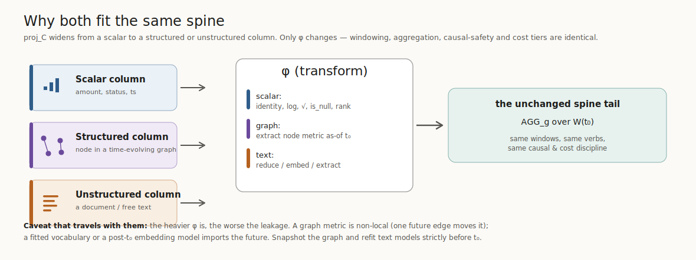
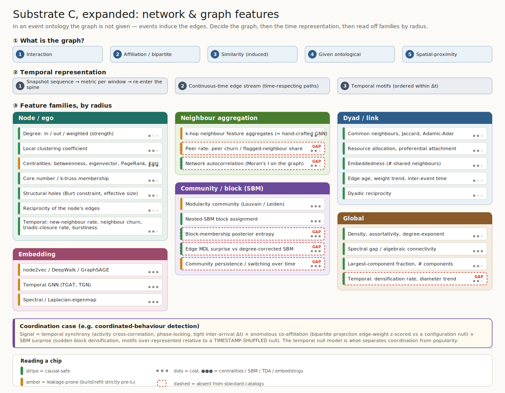
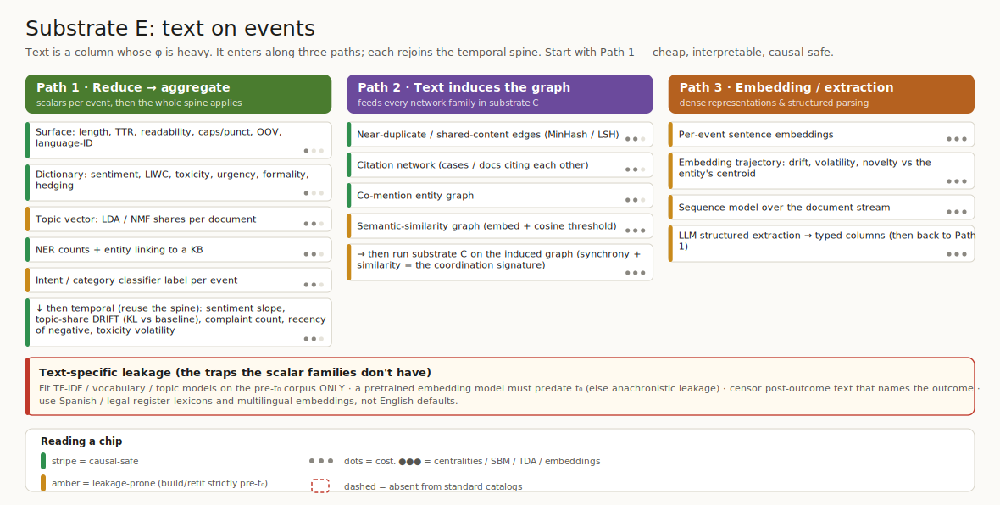

#+TITLE: Temporal Features II — Network & Text Substrates
#+SUBTITLE: Companion to "Temporal Feature Taxonomy for Event-Ontology Data" (substrates C-expanded and E)
#+OPTIONS: toc:2 num:t
#+STARTUP: showall inlineimages

* 0. Where this fits

This extends the main reference with the two substrates that break the
single-column-of-scalars assumption: the *relational graph* (substrate C, here
expanded from four chips into its own taxonomy) and *text on events* (a new
substrate E). Tag conventions are unchanged:

- =[safe]= backward-only by construction · =[care]= leakage-prone unless built /
  refit strictly on the pre-t₀ window.
- =●○○= cheap (SQL / recursive CTE) · =●●○= medium · =●●●= heavy (centralities,
  SBM, TDA, embeddings, LLM extraction).

** The unifying idea
The spine's projection =proj_C= was implicitly "pick a scalar column." Network
and text simply *widen the column type*: a structured column (the entity's
position in a time-evolving graph) and an unstructured column (a document). Each
needs a heavier transform φ, but after φ the windowing, aggregation,
causal-safety discipline, and cost tiers are identical to everything in the main
reference.

#+CAPTION: Scalar, graph, and text columns all pass through φ and re-enter the same spine tail. Only φ changes.

The corollary is the warning that travels with both: *the heavier φ is, the
worse the leakage.* A graph metric is non-local — one future edge anywhere can
change a node's centrality — and a fitted vocabulary or a post-t₀ embedding
model silently imports the future. Snapshot the graph and refit text models
strictly before t₀.

* 1. Substrate C — network & graph features

#+CAPTION: Network substrate: graph-construction choice, temporal representation, then families by radius.

** ① What is the graph?
In an event ontology the graph is /induced by events/; it is not handed to you.
Several non-equivalent graphs live in the same event table, and they produce
different features:

1. *Interaction graph* — entities are nodes; an event linking two of them is a
   directed, timestamped, multi-edge (A messages B, carrier serves port,
   inspector visits facility).
2. *Affiliation / bipartite graph* — entities ↔ shared objects (users↔URLs,
   facilities↔owners, shipments↔lanes), plus its one-mode co-affiliation
   projection.
3. *Similarity (induced) graph* — edges derived from co-movement or correlation
   (the cross-stream-dependence family: coherence / Granger networks).
4. *Given ontological graph* — the explicit relations table (ownership,
   hierarchy, jurisdiction); slowly-changing.
5. *Spatial-proximity graph* — entities linked when co-located within a
   space-time threshold (from substrate D).

** ② Temporal representation
- *Snapshot sequence* — bin edges into windows, compute static metrics per
  snapshot, then run the main-reference spine on the resulting node-level series
  ("trend in betweenness" is a slope over a graph metric).
- *Continuous-time edge stream* — keep edge timestamps; respect time-ordered
  paths and reachability; avoids snapshot-binning artifacts.
- *Temporal motifs* — small subgraphs with an ordering constraint (A→B then B→C
  within Δt); snapshots destroy these.

** ③ Feature families, by radius
*** Node / ego
- =[safe ●○○]= *Degree* — in / out / weighted (strength), in window.
- =[safe ●●○]= *Local clustering coefficient.*
- =[care ●●●]= *Centralities* — betweenness, eigenvector, PageRank, Katz,
  harmonic, closeness. =[care]= for non-locality, not for any two-sided window.
  =shipped 0.9.0= as ~CentralityBridge~ (cheap tier default, heavy opt-in,
  per-window snapshot rebuild); PageRank since 0.6.
- =[safe ●●○]= *Core number / k-truss membership* (coreness).
- =[safe ●●○]= *Structural holes* — Burt's constraint, effective size,
  brokerage roles.
- =[safe ●○○]= *Reciprocity* of the node's edges.
- =[safe ●●○]= *Ego dynamics* — new-neighbour acquisition rate, neighbour churn,
  triadic-closure rate, interaction burstiness, edge persistence.

*** Neighbour aggregation  (= hand-crafted message passing)
- =[care ●●○]= *k-hop neighbour feature aggregates* — mean / share of a property
  over 1-hop, 2-hop neighbours. k-hop aggregation is the manual form of a
  k-layer GNN. 2-hop aggregates leak neighbours' /future/ labels — the canonical
  temporal-GNN failure. =shipped 0.9.0= for 1-hop as the native
  ~graph_relationships~ planner stage (double as-of bound; 2-hop deliberately
  not offered).
- =[care ●●○]= *Peer rate* — flagged-neighbour share =shipped 0.9.0= (native
  ~neighbour_share~); peer churn *[GAP]*
- =[safe ●●○]= *Network autocorrelation* — Moran's I on the graph (label
  homophily). *[GAP]*

*** Dyad / link  (scoring a pair, or link prediction)
- =[safe ●●○]= *Common neighbours, Jaccard, Adamic-Adar.*
- =[safe ●●○]= *Resource allocation, preferential attachment.*
- =[safe ●●○]= *Embeddedness* — number of shared neighbours.
- =[safe ●○○]= *Edge age, weight trend, inter-event time on the edge.*
- =[safe ●○○]= *Dyadic reciprocity.*

*** Community / block (SBM)
- =[care ●●●]= *Modularity community* — Louvain / Leiden membership.
  =shipped 0.9.0= as ~CommunityBridge~ (Louvain membership + modularity;
  SBM stays deferred — graph-tool is not pip-installable).
- =[safe ●●●]= *Nested-SBM block assignment* (graph-tool) — block ID as a
  categorical feature.
- =[safe ●●●]= *Block-membership posterior entropy* — assignment uncertainty.
  *[GAP]*
- =[safe ●●●]= *Edge MDL surprise* — deviation of a node's edges from the
  degree-corrected SBM expectation; the anomaly signal. *[GAP]*
- =[care ●●●]= *Community persistence / switching* over time. *[GAP]*

*** Global
- =[safe ●●○]= *Density, assortativity, degree-distribution exponent.*
- =[safe ●●●]= *Spectral gap / algebraic connectivity.*
- =[safe ●●○]= *Largest-component fraction, number of components.*
- =[safe ●●○]= *Temporal* — densification rate, diameter trend. *[GAP]*

*** Embedding
- =[care ●●●]= *node2vec / DeepWalk / GraphSAGE.*
- =[care ●●●]= *Temporal GNN* — TGAT, TGN.
- =[care ●●●]= *Spectral / Laplacian-eigenmap* embeddings.

** The coordination case
Coordinated behaviour (the detection problem) is a /product/ of three temporal
signals, not any one of them:

- *Synchrony* — activity-series cross-correlation, phase-locking, tight
  inter-arrival Δt across a set of entities.
- *Co-affiliation* — bipartite-projection edge weight z-scored against a
  configuration (degree-preserving) null.
- *SBM surprise* — sudden block densification; motifs over-represented relative
  to a *timestamp-shuffled* null.

The temporal null model is the whole game: without it you cannot separate
coordination from popularity. (This is the engine behind nested-SBM coordinated
inauthentic behaviour detection.)

** Leakage & cost for graphs
- *Non-locality.* Centrality and global metrics depend on the whole graph, so a
  single future edge changes them. You must rebuild the graph from edges with
  =ts < t₀= only — you cannot compute "the graph" once and slice it.
- *Neighbour-label leakage.* 2-hop aggregates can pull a neighbour's
  post-t₀ label. Restrict aggregation to pre-t₀ edges /and/ pre-t₀ neighbour
  states.
- *Cost.* Degree, ego-density, 1–2-hop aggregates are cheap (recursive CTE in
  Postgres). Betweenness is O(VE); SBM inference, temporal-motif counting, and
  embeddings are =●●●= — compute on graph-tool / GPU and materialize back as
  feature columns keyed by (entity, t₀).

#+begin_src sql
-- cheap tier: 1-hop neighbour aggregate, as-of t0, no future edges
WITH edges_asof AS (
  SELECT src, dst FROM event_edge e, cohort c
  WHERE e.ts < c.t0 AND e.ts >= c.t0 - INTERVAL '90 days'
)
SELECT c.entity_id,
       count(*)                              AS degree_90d,
       avg(n.flag::int)                       AS peer_flag_share   -- n.flag must be pre-t0
FROM cohort c
LEFT JOIN edges_asof e   ON e.src = c.entity_id
LEFT JOIN entity_state n ON n.entity_id = e.dst AND n.valid_at < c.t0
GROUP BY c.entity_id;
#+end_src

* 2. Substrate E — text on events

#+CAPTION: Text substrate: three paths into the spine, with text-specific leakage.

Text is a column (ticket body, inspector's notes, post, court filing, bill of
lading) whose φ is heavy. It enters along three paths; each rejoins the spine.

** Path 1 — reduce → aggregate  (start here)
Collapse each document to scalars per event; then every window family applies.
The most interpretable and most causal-safe path.

- =[safe ●○○]= *Surface / lexical* — length, type-token ratio, readability
  (Flesch), caps / punctuation ratios, OOV rate, language ID. =shipped 0.9.0=
  for readability (Fernández-Huerta / Flesch, ~ReadabilityBridge~) and
  language ID (~LanguageIdBridge~, categorical); counts/ratios were already
  SQL-native transformers.
- =[safe ●○○]= *Dictionary scores* — sentiment (valence / arousal), LIWC
  categories (anger, certainty, hedging), toxicity, urgency, formality.
  =shipped 0.9.0= for sentiment valence (~SentimentBridge~, Spanish-register
  default, pluggable lexicon); LIWC / toxicity remain open.
- =[care ●●○]= *Topic vector* — LDA / NMF topic shares per document.
- =[safe ●●○]= *NER counts + entity linking* — persons / orgs / locations /
  money / dates; link to a KB. =shipped 0.9.0= for the counts
  (~NERCountsBridge~, one spaCy parse → five columns, multilingual default);
  entity linking remains open.
- =[care ●●○]= *Intent / category label* — classifier output per event
  (complaint vs query; violation-type from notes).
- =[safe ●●○]= *Then temporal (reuse the spine)* — sentiment slope (trajectory),
  *topic-share drift = KL / Wasserstein vs a baseline window* (this is the
  drift family applied to text), complaint count, recency of last
  negative-sentiment event, toxicity volatility.

** Path 2 — text induces the graph  (bridge to substrate C)
Documents create edges, which then feed every network family above.

- =[safe ●●○]= *Near-duplicate / shared-content edges* — MinHash / LSH; the
  copy-paste signature of coordination. =shipped 0.9.1= as
  ~NearDuplicateEdgeBridge~ (edge knowable at the *later* document; feeds the
  graph bridges or the native ~graph_relationships~ stage).
- =[safe ●●○]= *Citation network* — documents / cases citing one another (the
  natural object for legal corpora).
- =[safe ●●○]= *Co-mention entity graph* — entities mentioned together.
  =shipped 0.9.1= as ~CoMentionEdgeBridge~ (naive extractor built in,
  ~extract=~ pluggable).
- =[care ●●●]= *Semantic-similarity graph* — embed, connect by cosine threshold,
  detect communities over content.
- =[care ●●●]= *Then run substrate C on the induced graph* — text-similarity
  edges × temporal synchrony /is/ the coordination signature.

** Path 3 — embedding trajectory / structured extraction
- =[care ●●●]= *Per-event sentence embeddings.*
- =[care ●●●]= *Embedding trajectory* — distance travelled (semantic drift),
  volatility, *novelty* (distance of a new message from the entity's own
  centroid — "out of character?"). =shipped 0.9.1= as
  ~EmbeddingTrajectoryBridge~ (per-event novelty / drift / volatility over
  the strictly-prior history).
- =[care ●●●]= *Sequence model over the document stream.*
- =[care ●●●]= *LLM structured extraction* — parse free text into typed fields
  against a schema; the fields are then ordinary columns and you are back in
  Path 1. (The free-text → formal-DSL move.)

** Text-specific leakage
- Fit *TF-IDF / vocabulary / topic models on the pre-t₀ corpus only* — fitting
  on the full corpus leaks future term distributions.
- A *pretrained embedding model must predate t₀* — a model trained on later data
  is anachronistic leakage in a strict backtest.
- *Censor post-outcome text* that names the outcome ("cancelled because…").
- *Multilingual:* use Spanish / legal-register lexicons and multilingual
  embeddings, not English defaults.

* 3. Grounded to the working domains

| Family                         | Coordination / electoral        | Logistics                          | Inspections / legal                    |
|--------------------------------+---------------------------------+------------------------------------+----------------------------------------|
| Interaction-graph degree       | accounts an actor replies to    | carrier↔port service degree        | inspector↔facility visit degree        |
| Affiliation / co-content       | shared URLs / hashtags          | shared lanes / consignees          | shared owners across facilities        |
| SBM block + MDL surprise       | inauthentic cluster, anomaly    | unusual carrier-port community     | commonly-owned violation cluster       |
| Synchrony (temporal null)      | co-burst within Δt              | co-delay across lanes              | clustered re-inspection timing         |
| Peer aggregation               | flagged-neighbour share         | neighbour on-time rate             | peer-facility violation rate           |
| Text Path 1 (sentiment slope)  | shifting rhetoric over time     | complaint tone on a shipment       | severity language in notes over visits |
| Text Path 2 (near-dup edges)   | copy-paste campaign detection   | duplicated manifest text           | boilerplate vs specific findings       |
| Text Path 3 (LLM extraction)   | claim / frame extraction        | extract incident fields from notes | parse findings into typed violations   |

* 4. Slot-in summary

- Substrate C replaces the four relational chips in the main reference's §3 with
  the full radius taxonomy above; cross-stream dependence stays where it was.
- Substrate E is new: a text column reduces (Path 1), induces edges (Path 2 →
  substrate C), or embeds / extracts (Path 3 → typed columns → Path 1).
- Net new GAP families introduced here: peer / network-autocorrelation
  aggregation, SBM posterior-entropy & MDL-surprise, temporal global dynamics,
  and the entire text substrate. All re-enter the same spine after φ.
- Status as of 0.9.1: Path 1's core reductions (sentiment, NER counts,
  readability, language id), the multi-metric centralities, Louvain
  community, and the native 1-hop neighbour aggregation shipped in 0.9.0;
  Path 2's induced edges (near-duplicate, co-mention), Path 3's embedding
  trajectory (novelty / drift / volatility), and the change-point /
  periodicity sequence scores shipped in 0.9.1 (see the =shipped= markers).
  Remaining GAPs: peer churn, Moran's I, SBM entropy / MDL surprise,
  community persistence, global temporal dynamics, LLM structured
  extraction.

#  Local Variables:
#  org-image-actual-width: 1100
#  End:
